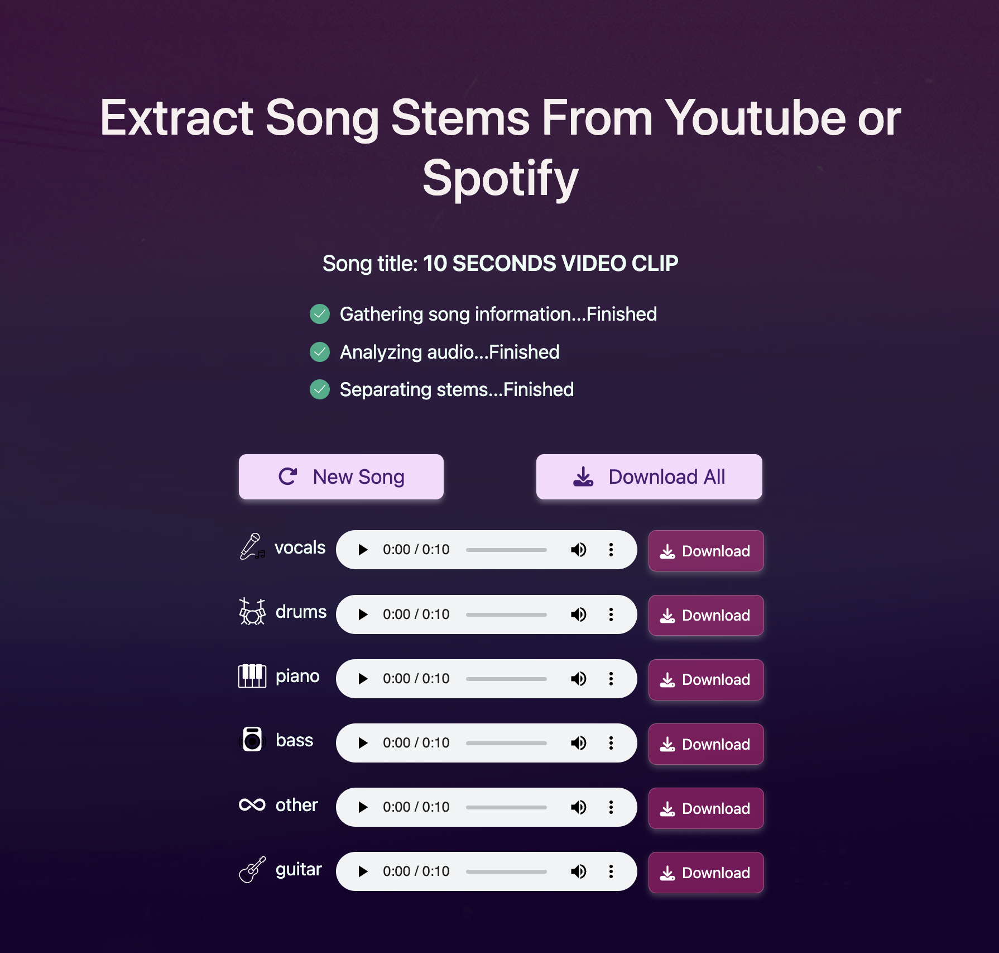

# spotify-youtube-stem-separator

## Extract the "stems" (e.g. drums, vocals, bass) from any song on Spotify or Youtube into separate audio files

## Introduction

This is a Flask web app using the following resources:

- [Demucs ML model](https://github.com/facebookresearch/demucs): Demucs is an music source separation model that creates the stems
- [yt-dlp](https://github.com/yt-dlp/yt-dlp): Extracts the audio from the YouTube videos before passing them into demucs.
- [Spotify API](https://developer.spotify.com/documentation/web-api) & [Youtube Data API](https://developers.google.com/youtube/v3) for URL conversion

## Screenshot



## Installation

0. Install Python

1. Clone the repository: Open a terminal and clone the repository using the following command:

   ```
   git clone https://github.com/otonomee/youtube-ai-stem-separator.git
   ```

2. Install dependencies: Navigate to the project directory and install the required dependencies
   by running the following command:

   ```
   pip install -r requirements.txt
   ```

3. Run the web app: Start the web app by running the following command:

   ```
   python main.py
   ```

   Or Mac

   ```
   sudo python3 main.py
   ```

4. Access the web app: Open your web browser and go to
   [http://127.0.0.1:5000](http://127.0.0.1:5000:5000) to access the web app.

## Usage

1. Enter the YouTube video URL: On the web app's homepage, enter the URL of the YouTube video you
   want to convert the audio from.

2. Select the number of stems you'd like:

   - 2 stems: vocals and instrumental
   - 4 stems: vocals, drums, bass, other
   - 6 stems: vocals, drums, bass, guitar, piano, other

3. Select desired output format

4. Hit Submit and wait a few minutes. Download prompt will appear when finished :)
